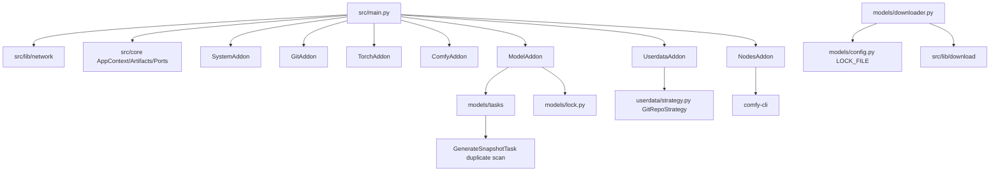

# Project Review v3

## 0. Meta

- Date: 2026-06-10
- Reviewer: Codex
- Based on: `REVIEW_GUIDE.md`, `REVIEW.md` v2, current source tree, external fact check in `docs/review/FACT_CHECK.md`, competitor scan in `docs/review/COMPETITOR_SCAN.md`
- Verification: `pytest tests/ -q` => `138 passed`

## 1. Executive Summary

1. Product positioning is clear: AutoDL-specific ComfyUI workstation recovery, not a generic launcher or SaaS.
2. The previous P0 still stands: `model-lock.yaml` is written to `/root/autodl-tmp/model-lock.yaml` but `model status` reads `my-comfyui-backup/model-lock.yaml`; the recovery inventory is broken.
3. The lock generation implementation is duplicated; the sync task loses `.meta` URL/source data that `lock.py` already knows how to preserve.
4. `bye` currently has unsafe success semantics: Git push/snapshot failures can log errors but still lead to “sync complete”.
5. README over-promises `.cache` migration; code does not implement it.
6. Network fallback is one of the strongest modules; keep the architecture, add user-facing safety and diagnostics.
7. The highest ROI work is not Web UI or cross-platform abstraction; it is `model status` diff, `doctor`, and sync failure visibility.
8. Tests report 138 passing, but critical integration/e2e files contain TODO-only classes; coverage is not aligned with product risk.
9. External research supports the no-auto-download principle: AutoDL data can be released, models are large, and HF/CivitAI auth/network states are variable.
10. Roadmap should be staged: fix lock/sync first, then readiness diagnostics, then optional workflow best-effort model dependency status.

## 2. 四视角观察

### 2.1 CEO 视角：定位 / 边界 / 长期

300 字定位陈述：

`autodl-instance` should be a personal AutoDL ComfyUI workstation manager. Its core job is not to download every model or become a cloud platform; it restores the executable environment, keeps creative state visible across instance churn, and gives the user a reliable manual path to recover large model assets. The product should invest in state visibility, sync correctness, and failure diagnosis. It should reject SaaS, Web dashboard, public model index, and automatic bulk model restore until the author explicitly changes the business direction. The moat is AutoDL-specific operational empathy: `/root` is disposable, `/root/autodl-tmp` is local fact but not backup, Git holds lightweight state, and model binaries remain user-controlled.

核心：
- 一键 setup/start/sync.
- Git-backed user/workflow/snapshot/model inventory.
- Manual model download with clear missing list.
- AutoDL network and two-disk compatibility.

装饰：
- Pretty dashboard.
- Cross-cloud abstraction.
- Public model catalog.
- Generic package manager.

反模式：
- setup/start 自动下载 5-30GB models.
- Treating lock as task source.
- Adding DB/backend/queue for a personal tool.

### 2.2 PM 视角：旅程 / 排序 / 摩擦

#### 6 条用户旅程

| Journey | Steps | Main friction | Type |
|---|---|---|---|
| 首次安装 | clone -> `./init.sh` -> setup 7 plugins -> generated commands | README says `.cache` migration happens, but code does not; network/proxy state is implicit | Tool + docs |
| 日常启动 | login -> `start` -> ComfyUI on 6006 | No readiness check before occupying GPU; model/node issues surface late | Tool |
| 主动下载模型 | `model download URL` or preset -> aria2 -> `.meta` | No disk preflight; failed CivitAI/HF auth not cataloged enough | Tool + platform |
| 关机前 | `bye` -> models snapshot -> nodes snapshot -> git push | Final success can be misleading if push failed | Tool |
| 新实例恢复 | clone -> init -> userdata restore -> nodes -> models symlink -> user checks model status | `model-lock.yaml` is not in the Git-visible path; user cannot see old inventory | Tool P0 |
| 出错诊断 | read terminal/log -> rerun commands | No `status`/`doctor`; integration tests do not encode failure modes | Tool |

#### RICE 矩阵

| Item | Reach | Impact | Confidence | Effort | RICE | Bucket |
|---|---:|---:|---:|---:|---:|---|
| Fix lock path + `model status` diff | 4 | 10 | 90% | 1.0d | 36.0 | A |
| Sync transaction result | 3 | 10 | 80% | 2.0d | 12.0 | A |
| `status` / `doctor` | 5 | 5 | 85% | 2.0d | 10.6 | A |
| Cache/docs + disk preflight | 2 | 5 | 85% | 1.5d | 5.7 | A |
| Workflow model dependency status | 3 | 5 | 60% | 3.0d | 3.0 | B/C |
| Node version lock | 1 | 5 | 75% | 2.0d | 1.9 | B |
| Web dashboard | 1 | 3 | 50% | 8.0d | 0.2 | D |
| Cross-cloud abstraction | 1 | 3 | 45% | 8.0d | 0.2 | D |

#### 被低估的高价值动作

1. `model status` 三态 diff + download hint.
2. `bye` 最终结果非 0 / warning summary.
3. Disk/cache preflight before large downloads.

#### 被高估的低价值动作

1. Web UI dashboard.
2. Cross-platform provider layer.
3. Public model index/catalog.

### 2.3 UX 视角：命令 / 提示 / 心智

#### CLI 评分

| Command | Self-explain | Next step on error | Progress visible | `--help` clarity | Notes |
|---|---:|---:|---:|---:|---|
| `./init.sh` | 4 | 3 | 3 | 2 | One-click is good; state mode is hidden. |
| `start` | 5 | 2 | 3 | 3 | Should show readiness warnings before launch. |
| `bye` | 4 | 1 | 3 | 2 | Final success semantics unsafe. |
| `model download` | 5 | 3 | 4 | 4 | Strongest UX; add disk/auth hints. |
| `model status` | 4 | 2 | 3 | 3 | Current path bug makes it misleading. |
| `turbo` | 3 | 2 | 2 | 2 | Name is memorable but not self-explanatory for non-AutoDL users. |

#### 隐式行为

- `setup_network()` runs before every Python entry and may choose mihomo/turbo by cache.
- `sync_proxy_config()` runs before plugin sync, so proxy config is pushed by userdata if Git push succeeds.
- `ComfyUI/models` is meant to become a symlink, but migration conflicts can leave a physical directory.
- `bye` stops proxy after sync.
- `model download` writes `.meta`, but `GenerateSnapshotTask` currently ignores that metadata.

#### 错误提示改写示例

Current risk: `logger.error("  -> Git push 失败: ...")` followed later by `同步完成`.

Suggested:

```text
[FAILED] 用户数据没有同步到远程仓库
原因：git push 返回非 0：<stderr summary>
下一步：请运行 cd my-comfyui-backup && git status && git push；不要释放实例，除非你确认本地数据不需要保留。
```

Current `model status` empty message says `model_lock.yaml`, but file is configured as `model-lock.yaml`.

Suggested:

```text
[WARN] 没有找到模型清单: my-comfyui-backup/model-lock.yaml
下一步：先运行 bye 生成清单；如果这是新实例，请确认 userdata_repo 已成功 clone/pull。
```

### 2.4 Tech Lead 视角：架构 / 债 / 测试

#### 模块依赖图



隐式耦合：
- `GenerateSnapshotTask` and `downloader.cmd_status` communicate through lock file path but use different constants.
- `my-comfyui-backup` is gitignored in this repo but expected to become a separate Git repo at runtime.
- `ComfyAddon`, `UserdataAddon`, `NodesAddon`, `ModelAddon` all rely on `Artifacts` being persisted after setup.
- Network config backup is coupled to `userdata` Git push order.

双源真相：
- Lock path: `GenerateSnapshotTask._get_lock_file_path()` vs `models/config.py:LOCK_FILE`.
- Model scan/hash: `GenerateSnapshotTask._scan_models/_generate_snapshot` vs `models/lock.py`.
- README cache behavior vs actual `SystemAddon`.
- Network doc path `src/lib/network.py` vs current package `src/lib/network/`.

SOLID notes:
- `AppContext` + ports are good for dependency inversion.
- `Artifacts` explicit DTO is pragmatic; no need to over-generalize.
- `GitRepoStrategy.push()` hides failure from lifecycle; interface should return structured result.
- `NodesAddon` owns snapshot restore, offline-mode mutation, clone, and dependency install; acceptable for now, but `nodes-lock` would justify extracting read-only inspection helpers.

#### 测试缺口

| Area | Current evidence | Gap |
|---|---|---|
| Unit lock helpers | `tests/unit/addons/test_models_lock.py` covers `lock.py` metadata and snapshot | Does not cover `GenerateSnapshotTask` path or `.meta` loss |
| Sync pipeline | `tests/integration/test_sync_pipeline.py` is TODO/pass | No assertion that sync is reverse or that lock is written to Git-visible path |
| E2E lifecycle | `tests/integration/test_e2e_scenarios.py` is TODO/pass | No setup->sync->status recovery test |
| Network fallback | Unit-ish coverage exists for pieces | No mihomo failure -> turbo user-visible summary |
| Download disk/auth failure | Not covered | Needed before large-model reliability claims |

## 3. 事实核查总结

Details: `docs/review/FACT_CHECK.md`.

Important constraints:
- AutoDL stopped instances can be released after 15 days, and released instance data is unrecoverable.
- AutoDL data disk is local and not a backup; Git/external storage remains necessary.
- AutoDL maps ports 6006/6008; current 127.0.0.1 binding is likely compatible with documented tunnel/custom service patterns, but public HTTP mode should be real-instance tested.
- `/etc/network_turbo` covers GitHub/HuggingFace but has no stability guarantee.
- `hf-mirror.com` documents `hfd` using `aria2`; this supports the project's aria2-first strategy.
- `huggingface_hub` cache defaults remain under `~/.cache/huggingface`; current README cache claim is not supported.

## 4. 竞品扫描总结

Details: `docs/review/COMPETITOR_SCAN.md`.

Conclusion:
- ComfyUI / ComfyUI-Manager / comfy-cli already solve core engine and node management. Reuse them.
- Stability Matrix owns desktop GUI packaging; do not chase it.
- RunPod worker and AI-Dock solve cloud image/API serving, not AutoDL personal recovery.
- The opportunity is not install. It is recovery visibility: “曾经有什么、现在缺什么、关机前是否真的同步成功”.

## 5. 问题清单

### P0

| ID | Issue | Evidence | Impact | Direction | RICE |
|---|---|---|---|---|---:|
| P0-1 | `model-lock.yaml` path mismatch | `src/addons/models/tasks/generate_snapshot.py:40-42`, `src/addons/models/config.py:18`, `src/addons/models/downloader.py:95-119` | New instance cannot see prior model inventory; `model status` misleading | RFC-001 | 36.0 |
| P0-2 | lock loses URL/source metadata in sync | `src/addons/models/lock.py:113-121` supports meta, but task duplicate does not | User sees model names without recovery source | RFC-001 | included |
| P0-3 | `bye` can imply success after critical sync failure | `src/addons/userdata/strategy.py:165-177`, `src/shutdown.py:37-44` | User may release instance after failed Git push | RFC-003 | 12.0 |

### P1

| ID | Issue | Evidence | Impact | Direction | RICE |
|---|---|---|---|---|---:|
| P1-1 | No project-level readiness check | Commands generated in `src/addons/system/plugin.py:71-96`; no status/doctor command | Failures surface after GPU launch | RFC-002 | 10.6 |
| P1-2 | README `.cache` migration false claim | `README.md:37-40`; `SystemAddon.setup()` only installs tools/uv/bin in `src/addons/system/plugin.py:23-25` | Trust gap; possible system disk pressure | RFC-004 | 5.7 |
| P1-3 | Tests give false confidence | `tests/integration/test_sync_pipeline.py:7-43`, `tests/integration/test_e2e_scenarios.py:7-35` | High-risk flows not encoded | Add integration tests in RFC-001/003 |
| P1-4 | Git credentials via Base64 private key need safer guidance | `src/addons/git_config/plugin.py:75-98`; `.gitignore:87-90` | Secrets are protected by ignore, but local/root compromise and accidental copy remain risks | Docs + `doctor` warnings |

### P2

| ID | Issue | Evidence | Impact | Direction |
|---|---|---|---|---|
| P2-1 | ComfyUI listens on `127.0.0.1` | `src/addons/comfy_core/plugin.py:159-162` | Likely OK per AutoDL docs, but should be tested on custom-service HTTP mode | Keep for now; test before changing |
| P2-2 | Node versions drift | `src/addons/nodes/manifest.yaml:5-19`; clone depth latest in `src/addons/nodes/plugin.py:190-194` | New instance may get changed node behavior | RFC-005 |
| P2-3 | Workflow model dependency unknown | No workflow model scanner | User discovers missing model late | RFC-006 |
| P2-4 | Node deps use `pip` not `uv` | `src/addons/nodes/plugin.py:111-115` | Slower/inconsistent install | Consider `uv pip install --system` later |

### P3

| ID | Issue | Decision |
|---|---|---|
| P3-1 | `pluggy` hooks are not using a PluginManager | Leave; current explicit pipeline is readable |
| P3-2 | SECURITY.md is generic | Improve when security docs are touched |
| P3-3 | Cross-platform hardcoding | Leave until author chooses cross-cloud direction |

## 6. 新需求 RFC 总览

| RFC | Title | RICE | Recommendation |
|---|---|---:|---|
| `RFCS/rfc-001-lock-path-and-status.md` | 统一 model-lock 路径并增强 status | 36.0 | Do first |
| `RFCS/rfc-002-project-status-doctor.md` | 新增 status / doctor 健康检查 | 10.6 | Do after lock |
| `RFCS/rfc-003-sync-transaction-and-failure-semantics.md` | 明确 bye/sync 事务语义 | 12.0 | Do with/after lock |
| `RFCS/rfc-004-cache-and-disk-preflight.md` | cache 迁移澄清与磁盘预检 | 5.7 | Do in first batch |
| `RFCS/rfc-005-node-version-locking.md` | 节点版本锁定与快照边界提示 | 1.9 | Defer |
| `RFCS/rfc-006-workflow-model-dependency-status.md` | workflow 模型依赖状态 | 3.0 | Prototype only |

## 7. 重构建议（含不动清单）

### 按 ROI 排序

| Refactor | Size | Value | Risk | ROI |
|---|---|---|---|---|
| Use `models/lock.py` from `GenerateSnapshotTask` | 1 file, ~80 LOC removed | Fix URL/source loss, remove duplicate scan | Low | Very high |
| Introduce a single `get_lock_file(ctx/project_root)` helper | 2-3 files | Fix P0 path mismatch | Low | Very high |
| Structured lifecycle result for sync | 4-6 files | Prevent false safe shutdown | Medium | High |
| Extract status checks as read-only helpers | 4-8 files | Enables `status`/`doctor` | Medium | High |
| Node lock generation | 2-4 files | Reduces node drift | Medium | Medium-low |

### 不动清单

- Do not rewrite network manager; `mihomo -> turbo -> no proxy` fallback is aligned with AutoDL reality.
- Do not move ComfyUI workspace to data disk until measured cold-start time proves it is necessary.
- Do not replace aria2 with `huggingface_hub`/`hf_xet` as default without fresh AutoDL tests.
- Do not add DB/Web backend.
- Do not generalize `Artifacts` into dynamic dicts; explicit DTO is useful here.

## 8. 路线图建议

### Phase 0: Trust Repair (1-2 days)

- RFC-001 lock path/status.
- README cache/download strategy correction.
- Add sync/status tests for lock path and `.meta` preservation.

### Phase 1: Safe Shutdown (2 days)

- RFC-003 sync result model.
- `bye` final summary with non-zero exit on critical failure.
- Manual recovery commands in error output.

### Phase 2: Readiness UX (2-3 days)

- RFC-002 `status` and minimal `doctor`.
- Disk/cache preflight from RFC-004.
- Start-time warning summary, non-blocking by default.

### Phase 3: Asset Intelligence (later)

- Node lock only if node drift happens again.
- Workflow model dependency scanner as best-effort prototype.
- External backup guide and `model export-list`.

## 9. Open Questions

Details: `docs/review/DECISIONS_NEEDED.md`.

Minimum decisions needed now:
- Keep ComfyUI on system disk?
- Explicitly defer Web UI?
- Keep model index personal-only?
- Prototype workflow model analysis or stay preset-only?
- Any cross-cloud target in 2026?
- External storage: guide only, export-list, or built-in rclone?

## 10. 反对前序 review 的地方

1. I disagree with treating `127.0.0.1:6006` as a likely change candidate. The previous review listed it as P2 needing confirmation; current AutoDL docs show tunnel/custom-service patterns around local ports, and changing to `0.0.0.0` can widen exposure. Keep `127.0.0.1` unless a real AutoDL custom-service HTTP test fails.
2. I partially disagree with “network subsystem: do not touch” as an absolute. The architecture should not be refactored, but UX/security text should change: subscription URL risk, current decision cache, and fallback mode should be visible in `doctor`.
3. I would raise sync semantics above some `model status` niceties. A missing diff is painful; a false “safe to close” after failed Git push is potentially destructive.

## 附录 A：事实核查与外部调研

See:
- `docs/review/FACT_CHECK.md`
- `docs/review/COMPETITOR_SCAN.md`

Main sourced conclusions used in this report:
- AutoDL instance data can be unrecoverable after release: https://www.autodl.com/docs/instance_data/
- AutoDL ports 6006/6008 are special mapped ports: https://www.autodl.com/docs/port/
- AutoDL academic acceleration covers GitHub/HuggingFace but has no guarantee: https://www.autodl.com/docs/network_turbo/
- ComfyUI-Manager snapshot path and limitations: https://github.com/Comfy-Org/ComfyUI-Manager
- comfy-cli already provides node/workflow/dependency commands: https://github.com/Comfy-Org/comfy-cli
- HuggingFace cache/env behavior: https://huggingface.co/docs/huggingface_hub/package_reference/environment_variables
- HF-Mirror hfd uses aria2: https://hf-mirror.com/
